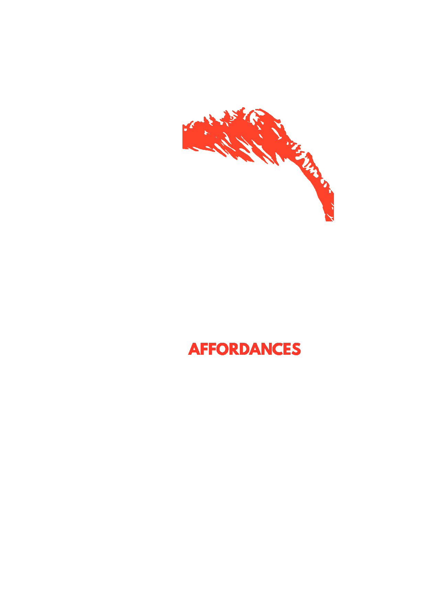

# Affordances

### Nature, structure, motivations and limitations of some fundamental levers towards a successful practice of liberation.

* [Queering](queering.html), by [Natacha Roussel](../appendix/attributions.html#natacha-roussel)
* [Nomadic Family](nomadic-family.html), by [Natacha Roussel](../appendix/attributions.html#natacha-roussel)
* [Self-Sufficiency](self-sufficiency.html), by [Pauline Gadea](../appendix/attributions.html#pauline-gadea)
* [Collective Validation](collective-validation.html), by [ginger coons](../appendix/attributions.html#ginger-coons)
* [Transdisciplinarity](transdisciplinarity.html), by [Mélanie Dulong de Rosnay](../appendix/attributions.html#melanie-dulong-de-rosnay)
* [Resilient Networks](resilient-networks.html), by [Jean-Noel Montagné](../appendix/attributions.html#jean-noel-montagne)
* [Reconciliation](reconciliation.html), by [hellekin](../appendix/attributions.html#hellekin), [Natacha Roussel](../appendix/attributions.html#natacha-roussel), and [Pauline Gadea](../appendix/attributions.html#pauline-gadea)
